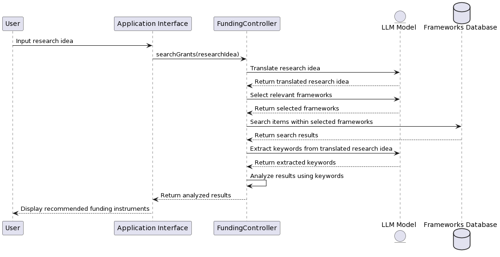

# Research Project: LLMs for Assessing R&D Funding Instruments

## Overview

This repository contains the codebase and related resources for a research project that aims to investigate the capabilities of Large Language Models (LLMs) in assessing research and development (R&D) funding instruments. The primary objective is to determine if LLMs can effectively recommend the best-fitting funding instruments to users based on their specific needs and criteria.

## Background

With the increasing complexity and variety of R&D funding instruments available, it becomes challenging for researchers and developers to identify the most suitable options. This project seeks to leverage the power of LLMs to simplify this process, providing users with tailored recommendations that align with their goals and requirements.

## Features

- **Data Collection**: Gather comprehensive data on various R&D funding instruments.
- **LLM Integration**: Utilize LLMs to process and analyze the collected data.
- **Recommendation Engine**: Generate personalized funding instrument recommendations for users.
- **User Interface**: A simple and intuitive interface for users to input their criteria and receive recommendations.

# System Flow of the R&D Funding Instruments Recommendation Engine

The R&D Funding Instruments Recommendation Engine is designed to streamline the process of matching research ideas with the most suitable funding instruments. By leveraging the capabilities of Large Language Models (LLMs), the system can effectively analyze, translate, and extract relevant keywords from user input to provide tailored recommendations.

## Flow Overview:

1. **User Input**: Researchers input their specific research idea into the application interface.
2. **Translation**: The research idea is translated using an LLM to ensure it aligns with the language of the funding instruments.
3. **Framework Selection**: The LLM selects the most relevant funding frameworks based on the translated research idea.
4. **Search**: The system searches for items within the selected frameworks.
5. **Keyword Extraction**: The LLM extracts pertinent keywords from the translated research idea to refine the search further.
6. **Analysis**: The system analyzes the search results using the extracted keywords to determine the most relevant funding opportunities.
7. **Output**: The system returns a list of recommended funding instruments to the user.

## System Diagram:



This diagram provides a visual representation of the system's flow, highlighting the interactions between the user, the application interface, the funding controller, the frameworks database, and the LLM model.

# Llama Model Server Setup Guide for Inference

Before you can use the Flask app for model inference, you need to set up the environment for serving the model. The process involves obtaining the model, positioning it in the proper directory, and configuring any necessary dependencies.

## Steps to Set Up Llama Model Server:

1. **Prepare the Model Directory**:
    - Move to a directory named `llm` in your repository where you'll serve the model.

2. **Clone and Build the llama.cpp Repository**:
    - Clone the `llama.cpp` repository from [https://github.com/ggerganov/llama.cpp](https://github.com/ggerganov/llama.cpp).
    - Follow the build instructions provided in the repository guide to prepare the environment. (run `make -j`)

3. **Download and Position the Model**:
    - Acquire the model you're using in the GGUF format.
    - Add your GGUF model to the `models` folder of the cloned repository.
    - Add the name of your model in the api.py file.

4. **Running the Flask App**:
    - Inside your `llm` directory, you'll find the Python script `api.py` which contains the Flask app that interfaces with the model.
    - Execute the command: `python api.py` to initiate the Flask app.
    - This command starts a development server on `localhost:8000`.

5. **For Model Inference**:
    - With the Flask server active, direct a POST request to `localhost:8000/query` to interact with the model and get inference results.

6. **Dependencies for the LLM Directory**:
    - To establish and operate the model server, the following tools and packages are required:
        - `make`: for building the `llama.cpp` repository.
        - `python`: for running the Flask app.
        - Any additional dependencies specified in the `llama.cpp` repository '
        - Install Flask and termcolor for `api.py` with `pip install Flask termcolor`

Once these steps are complete, your Flask app will be set to receive and process prompts, returning model-generated responses. Now you can move to the next section.

## Usage

1. Clone the repository.
2. Follow the setup instructions below.
3. Run the application and input your specific criteria.
4. Receive tailored recommendations on the best-fitting R&D funding instruments.

## How to Run the Program

### Prerequisites
- Ensure you have Node.js installed on your computer.
- A `.env` file must be present in the `server` directory with the `OPENAI_API_KEY` set to your OpenAI API key and `DB_PASSWORD` set to your database passsword.

### Steps

1. **Clone the Repository**

```git clone <repo_url>```

2. **Install Dependencies**
- Navigate to the `fundai` folder and run:
  ```npm install```
- Navigate to the `server` folder and run:
  ```npm install```

3. **Setup PostgreSQL Database**
- Start your PostgreSQL service.
- Create a new database for the project.
- Update the database connection details in the server directory configuration.

4. **Populate the Database** 
- In the server directory, run:
- ```node savedata.js```

5. **Build the Project**
- In the `fundai` folder, run:
  ```npm run build```
- In the `server` folder, run:
  ```npm run build```

6. **Start the Application**
- In the `fundai` folder, run:
  ```npm start```
- In the `server` folder, run:
  ```npm start```

After following these steps, the client should be running on port 3000 and the server should be running on port 5000.


## Contribution

If you're interested in contributing to this research project, please contact the `LICENSE.md` email.

## License

This project is licensed under the MIT License. See the `LICENSE.md` file for details.

## Acknowledgements

We'd like to thank all the contributors and participants in this research project. Your insights and efforts are invaluable to advancing the field of R&D funding instrument assessment.
